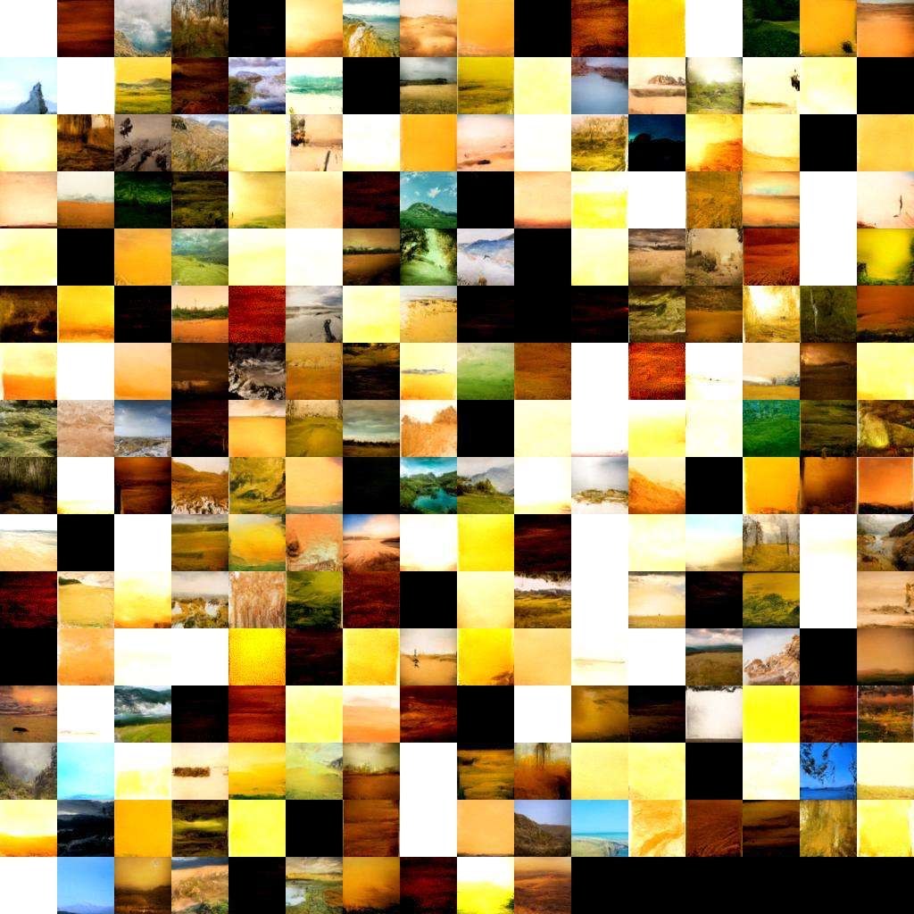

# Diffusion Models
This is a modified version of the easy-to-understand implementation of diffusion models by [@dome272](https://github.com/dome272). Different from other implementations, this code doesn't use the lower-bound formulation for sampling and strictly follows Algorithm 1 from the [DDPM](https://arxiv.org/pdf/2006.11239.pdf) paper, which makes it extremely short and easy to follow.

This version makes it possible to train and sample the unconditional model through a CLI using the [fire library](https://github.com/google/python-fire). If fire is not installed on your computer yet, download it using:
```bash
pip install fire
```

## Training on your own data
A diffusion model can be trained on a dataset of images, for instance [./datasets/landscapes/](./datasets/landscapes/). Training is done by using the following command:
```bash
python ddpm.py train --dataset=DATASET_PATH --epochs=EPOCHS_COUNT --batch_size=BATCH_SIZE --run_name=RUN_NAME
```
Remember the name of the run, it will be needed for sampling using the model once it has been trained. <br>
There are other options available for this command, learn more about them by running:
```bash
python ddpm.py train --help
```

## Sampling using a previously trained model
Once a diffusion model as been trained following the instruction in the section above, it can be used to sample new images with the command:
```bash
python ddpm.py sample --n_img=NUMBER_OF_IMAGES_TO_SAMPLE --run_name=RUN_NAME
```
The sampled images will be stored in the results directory. The name of the run is the one you used to train the model. This allows you to train multiple models, store them all and sample from them latter. <br>
You can get help by using:
```bash
python ddpm.py sample --help
```

## Example
An example dataset is provided at [./datasets/landscapes/](./datasets/landscapes/) if you do not have one. It is a set of +4000 pictures of landscapes, taken from [Kaggle](https://www.kaggle.com/code/nextlevelkrinj/dcgan-landscape-image-generation). <br>
If you do not have the time to train the model yourself and only want to try to sample, you can use the example pretrained model by using "landscapes" as the run name in the sampling command. This model has been trained in 500 epochs and produced the following samples:


<hr>

A more advanced version of the original code can be found [here](https://github.com/tcapelle/Diffusion-Models-pytorch) by [@tcapelle](https://github.com/tcapelle). It introduces better logging, faster & more efficient training and other nice features and is also being followed by a nice [write-up](https://wandb.ai/capecape/train_sd/reports/Training-a-Conditional-Diffusion-model-from-scratch--VmlldzoyODMxNjE3).